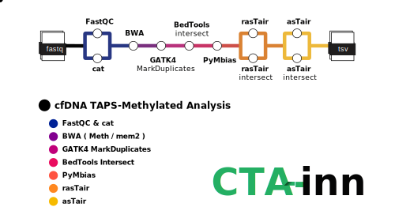

# MSKCC/CTI/CTAinn

[](https://www.nf-test.com)
[](https://www.nextflow.io/)
[](https://docs.conda.io/en/latest/)
[](https://www.docker.com/)
[](https://sylabs.io/docs/)
[](https://cloud.seqera.io/launch?pipeline=https://github.com/mskcmoinn/ctainn)


## Introduction

**MSKCC-CTI/CTAinn** is a `C`omprehensive `T`APS `A`nalysis pipeline Nextflow/nf-core borne designed to be highly flexible and can be run on a wide range of computing environments, from a single laptop, to a computing cluster or cloud computing environments.

CTAinn processes TAPS (TET-assisted pyridine borane sequencing) data to analyze DNA methylation patterns. The pipeline takes raw FASTQ files from TAPS sequencing experiments and performs quality control, alignment, methylation calling, and comprehensive downstream analysis. It generates various outputs including quality metrics, methylation reports, and visualization files that enable researchers to understand DNA methylation patterns in their samples.

> TAPS stands for TET-assisted pyridine borane sequencing.

## Pipeline Overview



The pipeline includes the following main steps:

1. Quality Control ([`FastQC`](https://www.bioinformatics.babraham.ac.uk/projects/fastqc/))
   * Comprehensive quality assessment of raw sequencing reads
2. Concatenate FASTQs ([`cat`](https://man7.org/linux/man-pages/man1/cat.1.html))
   * Combines multiple FASTQ files for the same sample
3.1. Mapping ([`BWA-Meth`](https://github.com/brentp/bwa-meth))
   * Alignment of bisulfite-converted reads to reference genome
3.2. Mapping ([`BWA mem2`](https://https://github.com/bwa-mem2/bwa-mem2))
   * The next version of bwa-mem
4. Mark Duplicates ([`GATK4-MarkDuplicates`](https://gatk.broadinstitute.org/hc/en-us/articles/13832748517275-MarkDuplicates-Picard))
   * Identification and marking of PCR duplicates
5.1 Methylation Calling ([`rasTair`](https://bitbucket.org/bsblabludwig/rastair/src/master/))
   * Extraction of methylation calls from aligned reads
5.2 Methylation Calling ([`asTair`](https://bitbucket.org/bsblabludwig/astair/src/master/))
   * Extraction of methylation calls from aligned reads
6. MultiQC ([`MultiQC`](https://multiqc.info/))
   * Aggregation of all QC reports into a single dashboard

## Usage

> [!NOTE]
> If you are new to Nextflow, please refer to [this page](https://nf-co.re/docs/usage/installation) on how to set-up Nextflow.

### Input Preparation

First, prepare a samplesheet with your input data that looks as follows:

`samplesheet.csv`:

```csv
sample,fastq_1,fastq_2
CONTROL_REP1,AEG588A1_S1_L002_R1_001.fastq.gz,AEG588A1_S1_L002_R2_001.fastq.gz
TREATMENT_REP1,AEG588A2_S2_L002_R1_001.fastq.gz,AEG588A2_S2_L002_R2_001.fastq.gz
```

The samplesheet requires the following columns:
* `sample`: Unique sample identifier
* `fastq_1`: Path to forward reads (R1)
* `fastq_2`: Path to reverse reads (R2)

### Running the Pipeline

You can run the pipeline using:

```bash
nextflow run </path/to/>/ctainn \
   -profile <docker/singularity> \
   --input samplesheet.csv \
   --genome GRCh38 \
   --outdir results
```

### Key Parameters

* `--input`: Path to samplesheet CSV file
* `--outdir`: Output directory path
* `--email`: Email address for completion notification
* `--max_memory`: Maximum memory to use (default: '128.GB')
* `--max_cpus`: Maximum CPUs to use (default: 12)

> [!WARNING]
> Please provide pipeline parameters via the CLI or Nextflow `-params-file` option. Custom config files including those provided by the `-c` Nextflow option can be used to provide any configuration _**except for parameters**_; see [docs](https://nf-co.re/docs/usage/getting_started/configuration#custom-configuration-files).

## Credits

mskcc-cti/ctainn was originally written by blancoj@mskcc.org.

We thank the following people for their extensive assistance in the development of this pipeline:

* The nf-core community - Framework and best practices

## Contributions and Support

If you would like to contribute to this pipeline, please see the [contributing guidelines](.github/CONTRIBUTING.md).

For support, please:
1. Read the pipeline documentation
2. Check existing issues
3. Create a new issue with a detailed description of your problem

## Citations

If you use mskcmoinn/ctainn for your analysis, please cite it using the following doi: [10.5281/zenodo.XXXXXX](https://doi.org/10.5281/zenodo.XXXXXX)

Key tools used in this pipeline:

* BWA-Meth
  > Pedersen BS, et al. Fast and accurate alignment of long bisulfite-seq reads. arXiv:1401.1129, 2014.

TO-DO: Complete the citations

An extensive list of references for the tools used by the pipeline can be found in the [`CITATIONS.md`](CITATIONS.md) file.

This pipeline uses code and infrastructure developed and maintained by the [nf-core](https://nf-co.re) community, reused here under the [MIT license](https://github.com/nf-core/tools/blob/main/LICENSE).

> **The nf-core framework for community-curated bioinformatics pipelines.**
>
> Philip Ewels, Alexander Peltzer, Sven Fillinger, Harshil Patel, Johannes Alneberg, Andreas Wilm, Maxime Ulysse Garcia, Paolo Di Tommaso & Sven Nahnsen.
>
> _Nat Biotechnol._ 2020 Feb 13. doi: [10.1038/s41587-020-0439-x](https://dx.doi.org/10.1038/s41587-020-0439-x).

